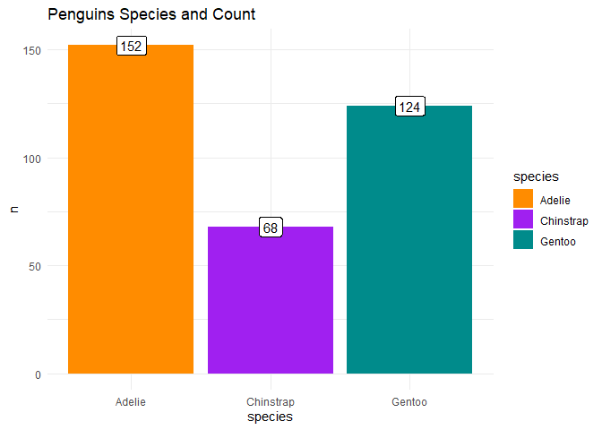

Markdown Hello
================
Dan Simonet
2022-05-09

## R Markdown

The `iris` data set has been used, abused, and recycled in the r
ecosystem. It is frequently used to showcase a package, test out a new
skill, or explain a statistical concept. `Iris` is popular because it is
accessible, clean, small, and boring.

The R community has recently called for the retirement of `iris` for
many reasons, such as being unrealistically well-structured or
associated with Ronald Fisher’s eugenicist past. Before going all cancel
culture on data there is a simpler reason to drop `iris`: most people
are not botanists and know nothing about flowers. What’s a setosa? I
have no idea. What’s the difference between the petal and sepal?
Something about color and whorls. What is a wide versus deep flower -
maybe sunflower?

An important approach to teaching statistics is **context**. Use
intuitive, relatable examples. I have always avoided `iris` because
using k-means to cluster flowers or correlating sepal width and petal
height never offer insights. Students just nod and say, “cool circles”.

Enter **penguins**. Everyone loves little, sweet penguins and, more
importantly, it is easy to visualize flippers, beaks, and body weights.
Thanks to Allison Horst we have the fantastic `palmerpenguins` package
which gives a mixture of data types, some missing values, and clear ways
to differentiate species. A great package for experimentation.

## Exploring `palmerpenguins`

First lets load some packages and get a quick visual breakdown of how
many species we are working with.

``` r
pacman::p_load(
  palmerpenguins,
  tidyverse
)

penguins %>% 
  count(species) %>%
  ggplot() +
  geom_col(aes(x = species, y = n, fill = species)) +
  geom_label(aes(x = species, y = n, label = n)) +
  scale_fill_manual(values = c("darkorange","purple","cyan4")) +
  theme_minimal() +
  labs(title = "Penguins Species and Count")
```

<!-- -->
